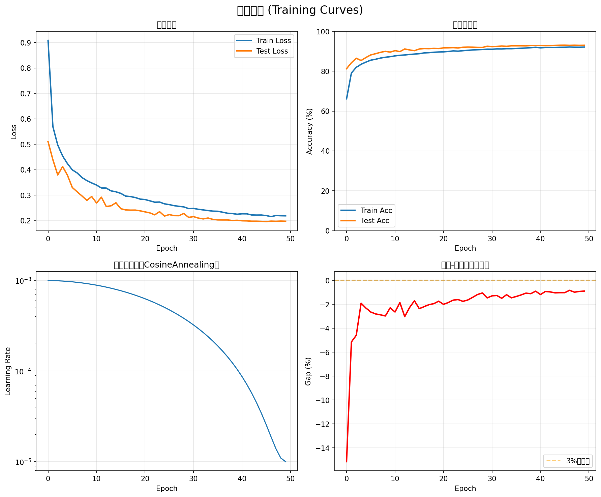

🖥️  使用设备: mps
   ⚡ 使用Apple Silicon GPU (MPS)

📥 加载数据集...
  ✓ 训练集: 60000 张图片
  ✓ 测试集: 10000 张图片
  ✓ Batch size: 128

🏗️  创建模型...
  ✓ 模型参数总量: 252,106
  ✓ 可训练参数: 252,106

⚙️  配置训练参数...

============================================================
🎯 开始训练！目标：95%+
============================================================

Epoch   1/50
----------------------------------------
Training:   0%|          | 0/469 [00:00<?, ?it/s]/Users/yijian/miniforge3/envs/ai_m4/lib/python3.11/site-packages/torch/utils/data/dataloader.py:1118: UserWarning: 'pin_memory' argument is set as true but not supported on MPS now, device pinned memory won't be used.
  super().__init__(loader)
                                                                                    
📈 Epoch 1 结果:
   Train Loss: 0.9083 | Train Acc: 66.11%
   Test  Loss: 0.5103 | Test  Acc: 81.26%
   LR: 0.000999
  💾 保存最佳模型！(Acc: 81.26%)

Epoch   2/50
----------------------------------------
                                                                                    
📈 Epoch 2 结果:
   Train Loss: 0.5689 | Train Acc: 79.11%
   Test  Loss: 0.4389 | Test  Acc: 84.25%
   LR: 0.000996
  💾 保存最佳模型！(Acc: 84.25%)

Epoch   3/50
----------------------------------------
                                                                                    
📈 Epoch 3 结果:
   Train Loss: 0.4968 | Train Acc: 81.94%
   Test  Loss: 0.3792 | Test  Acc: 86.52%
   LR: 0.000991
  💾 保存最佳模型！(Acc: 86.52%)

Epoch   4/50
----------------------------------------
                                                                                    
📈 Epoch 4 结果:
   Train Loss: 0.4539 | Train Acc: 83.46%
   Test  Loss: 0.4125 | Test  Acc: 85.36%
   LR: 0.000984

Epoch   5/50
----------------------------------------
                                                                                    
📈 Epoch 5 结果:
   Train Loss: 0.4239 | Train Acc: 84.57%
   Test  Loss: 0.3781 | Test  Acc: 86.88%
   LR: 0.000976
  💾 保存最佳模型！(Acc: 86.88%)

Epoch   6/50
----------------------------------------
                                                                                    
📈 Epoch 6 结果:
   Train Loss: 0.3994 | Train Acc: 85.53%
   Test  Loss: 0.3300 | Test  Acc: 88.17%
   LR: 0.000965
  💾 保存最佳模型！(Acc: 88.17%)

Epoch   7/50
----------------------------------------
                                                                                    
📈 Epoch 7 结果:
   Train Loss: 0.3871 | Train Acc: 85.99%
   Test  Loss: 0.3130 | Test  Acc: 88.79%
   LR: 0.000953
  💾 保存最佳模型！(Acc: 88.79%)

Epoch   8/50
----------------------------------------
                                                                                    
📈 Epoch 8 结果:
   Train Loss: 0.3689 | Train Acc: 86.60%
   Test  Loss: 0.2966 | Test  Acc: 89.47%
   LR: 0.000939
  💾 保存最佳模型！(Acc: 89.47%)

Epoch   9/50
----------------------------------------
                                                                                    
📈 Epoch 9 结果:
   Train Loss: 0.3572 | Train Acc: 86.99%
   Test  Loss: 0.2793 | Test  Acc: 89.96%
   LR: 0.000923
  💾 保存最佳模型！(Acc: 89.96%)

Epoch  10/50
----------------------------------------
                                                                                    
📈 Epoch 10 结果:
   Train Loss: 0.3480 | Train Acc: 87.28%
   Test  Loss: 0.2945 | Test  Acc: 89.57%
   LR: 0.000905

Epoch  11/50
----------------------------------------
                                                                                    
📈 Epoch 11 结果:
   Train Loss: 0.3394 | Train Acc: 87.69%
   Test  Loss: 0.2690 | Test  Acc: 90.32%
   LR: 0.000886
  💾 保存最佳模型！(Acc: 90.32%)

Epoch  12/50
----------------------------------------
                                                                                    
📈 Epoch 12 结果:
   Train Loss: 0.3282 | Train Acc: 87.98%
   Test  Loss: 0.2918 | Test  Acc: 89.83%
   LR: 0.000866

Epoch  13/50
----------------------------------------
                                                                                    
📈 Epoch 13 结果:
   Train Loss: 0.3276 | Train Acc: 88.14%
   Test  Loss: 0.2552 | Test  Acc: 91.16%
   LR: 0.000844
  💾 保存最佳模型！(Acc: 91.16%)

Epoch  14/50
----------------------------------------
                                                                                    
📈 Epoch 14 结果:
   Train Loss: 0.3167 | Train Acc: 88.40%
   Test  Loss: 0.2580 | Test  Acc: 90.66%
   LR: 0.000821

Epoch  15/50
----------------------------------------
                                                                                    
📈 Epoch 15 结果:
   Train Loss: 0.3130 | Train Acc: 88.59%
   Test  Loss: 0.2700 | Test  Acc: 90.29%
   LR: 0.000796

Epoch  16/50
----------------------------------------
                                                                                    
📈 Epoch 16 结果:
   Train Loss: 0.3069 | Train Acc: 88.78%
   Test  Loss: 0.2466 | Test  Acc: 91.14%
   LR: 0.000770

Epoch  17/50
----------------------------------------
                                                                                    
📈 Epoch 17 结果:
   Train Loss: 0.2962 | Train Acc: 89.17%
   Test  Loss: 0.2418 | Test  Acc: 91.36%
   LR: 0.000743
  💾 保存最佳模型！(Acc: 91.36%)

Epoch  18/50
----------------------------------------
                                                                                    
📈 Epoch 18 结果:
   Train Loss: 0.2943 | Train Acc: 89.29%
   Test  Loss: 0.2410 | Test  Acc: 91.31%
   LR: 0.000716

Epoch  19/50
----------------------------------------
                                                                                    
📈 Epoch 19 结果:
   Train Loss: 0.2905 | Train Acc: 89.51%
   Test  Loss: 0.2411 | Test  Acc: 91.45%
   LR: 0.000687
  💾 保存最佳模型！(Acc: 91.45%)

Epoch  20/50
----------------------------------------
                                                                                    
📈 Epoch 20 结果:
   Train Loss: 0.2843 | Train Acc: 89.63%
   Test  Loss: 0.2382 | Test  Acc: 91.36%
   LR: 0.000658

Epoch  21/50
----------------------------------------
                                                                                    
📈 Epoch 21 结果:
   Train Loss: 0.2826 | Train Acc: 89.70%
   Test  Loss: 0.2341 | Test  Acc: 91.70%
   LR: 0.000628
  💾 保存最佳模型！(Acc: 91.70%)

Epoch  22/50
----------------------------------------
                                                                                    
📈 Epoch 22 结果:
   Train Loss: 0.2775 | Train Acc: 89.90%
   Test  Loss: 0.2301 | Test  Acc: 91.74%
   LR: 0.000598
  💾 保存最佳模型！(Acc: 91.74%)

Epoch  23/50
----------------------------------------
                                                                                    
📈 Epoch 23 结果:
   Train Loss: 0.2722 | Train Acc: 90.18%
   Test  Loss: 0.2225 | Test  Acc: 91.82%
   LR: 0.000567
  💾 保存最佳模型！(Acc: 91.82%)

Epoch  24/50
----------------------------------------
                                                                                    
📈 Epoch 24 结果:
   Train Loss: 0.2729 | Train Acc: 90.05%
   Test  Loss: 0.2349 | Test  Acc: 91.65%
   LR: 0.000536

Epoch  25/50
----------------------------------------
                                                                                    
📈 Epoch 25 结果:
   Train Loss: 0.2657 | Train Acc: 90.28%
   Test  Loss: 0.2176 | Test  Acc: 92.02%
   LR: 0.000505
  💾 保存最佳模型！(Acc: 92.02%)

Epoch  26/50
----------------------------------------
                                                                                    
📈 Epoch 26 结果:
   Train Loss: 0.2627 | Train Acc: 90.49%
   Test  Loss: 0.2234 | Test  Acc: 92.12%
   LR: 0.000474
  💾 保存最佳模型！(Acc: 92.12%)

Epoch  27/50
----------------------------------------
                                                                                    
📈 Epoch 27 结果:
   Train Loss: 0.2585 | Train Acc: 90.66%
   Test  Loss: 0.2193 | Test  Acc: 92.07%
   LR: 0.000443

Epoch  28/50
----------------------------------------
                                                                                    
📈 Epoch 28 结果:
   Train Loss: 0.2559 | Train Acc: 90.77%
   Test  Loss: 0.2191 | Test  Acc: 91.94%
   LR: 0.000412

Epoch  29/50
----------------------------------------
                                                                                    
📈 Epoch 29 结果:
   Train Loss: 0.2537 | Train Acc: 90.86%
   Test  Loss: 0.2277 | Test  Acc: 91.91%
   LR: 0.000382

Epoch  30/50
----------------------------------------
                                                                                    
📈 Epoch 30 结果:
   Train Loss: 0.2470 | Train Acc: 91.06%
   Test  Loss: 0.2124 | Test  Acc: 92.52%
   LR: 0.000352
  💾 保存最佳模型！(Acc: 92.52%)

Epoch  31/50
----------------------------------------
                                                                                    
📈 Epoch 31 结果:
   Train Loss: 0.2476 | Train Acc: 91.03%
   Test  Loss: 0.2155 | Test  Acc: 92.32%
   LR: 0.000323

Epoch  32/50
----------------------------------------
                                                                                    
📈 Epoch 32 结果:
   Train Loss: 0.2443 | Train Acc: 91.17%
   Test  Loss: 0.2097 | Test  Acc: 92.43%
   LR: 0.000294

Epoch  33/50
----------------------------------------
                                                                                    
📈 Epoch 33 结果:
   Train Loss: 0.2418 | Train Acc: 91.15%
   Test  Loss: 0.2065 | Test  Acc: 92.64%
   LR: 0.000267
  💾 保存最佳模型！(Acc: 92.64%)

Epoch  34/50
----------------------------------------
                                                                                    
📈 Epoch 34 结果:
   Train Loss: 0.2392 | Train Acc: 91.29%
   Test  Loss: 0.2099 | Test  Acc: 92.48%
   LR: 0.000240

Epoch  35/50
----------------------------------------
                                                                                    
📈 Epoch 35 结果:
   Train Loss: 0.2370 | Train Acc: 91.28%
   Test  Loss: 0.2047 | Test  Acc: 92.73%
   LR: 0.000214
  💾 保存最佳模型！(Acc: 92.73%)

Epoch  36/50
----------------------------------------
                                                                                    
📈 Epoch 36 结果:
   Train Loss: 0.2365 | Train Acc: 91.39%
   Test  Loss: 0.2026 | Test  Acc: 92.73%
   LR: 0.000189

Epoch  37/50
----------------------------------------
                                                                                    
📈 Epoch 37 结果:
   Train Loss: 0.2328 | Train Acc: 91.53%
   Test  Loss: 0.2024 | Test  Acc: 92.74%
   LR: 0.000166
  💾 保存最佳模型！(Acc: 92.74%)

Epoch  38/50
----------------------------------------
                                                                                    
📈 Epoch 38 结果:
   Train Loss: 0.2288 | Train Acc: 91.64%
   Test  Loss: 0.2024 | Test  Acc: 92.70%
   LR: 0.000144

Epoch  39/50
----------------------------------------
                                                                                    
📈 Epoch 39 结果:
   Train Loss: 0.2275 | Train Acc: 91.79%
   Test  Loss: 0.2003 | Test  Acc: 92.89%
   LR: 0.000124
  💾 保存最佳模型！(Acc: 92.89%)

Epoch  40/50
----------------------------------------
                                                                                    
📈 Epoch 40 结果:
   Train Loss: 0.2248 | Train Acc: 92.00%
   Test  Loss: 0.2011 | Test  Acc: 92.89%
   LR: 0.000105

Epoch  41/50
----------------------------------------
                                                                                    
📈 Epoch 41 结果:
   Train Loss: 0.2266 | Train Acc: 91.72%
   Test  Loss: 0.1991 | Test  Acc: 92.90%
   LR: 0.000087
  💾 保存最佳模型！(Acc: 92.90%)

Epoch  42/50
----------------------------------------
                                                                                    
📈 Epoch 42 结果:
   Train Loss: 0.2264 | Train Acc: 91.89%
   Test  Loss: 0.1987 | Test  Acc: 92.81%
   LR: 0.000071

Epoch  43/50
----------------------------------------
                                                                                    
📈 Epoch 43 结果:
   Train Loss: 0.2220 | Train Acc: 91.91%
   Test  Loss: 0.1975 | Test  Acc: 92.86%
   LR: 0.000057

Epoch  44/50
----------------------------------------
                                                                                    
📈 Epoch 44 结果:
   Train Loss: 0.2215 | Train Acc: 91.91%
   Test  Loss: 0.1975 | Test  Acc: 92.94%
   LR: 0.000045
  💾 保存最佳模型！(Acc: 92.94%)

Epoch  45/50
----------------------------------------
                                                                                    
📈 Epoch 45 结果:
   Train Loss: 0.2217 | Train Acc: 92.01%
   Test  Loss: 0.1968 | Test  Acc: 93.03%
   LR: 0.000034
  💾 保存最佳模型！(Acc: 93.03%)

Epoch  46/50
----------------------------------------
                                                                                    
📈 Epoch 46 结果:
   Train Loss: 0.2196 | Train Acc: 92.04%
   Test  Loss: 0.1958 | Test  Acc: 93.06%
   LR: 0.000026
  💾 保存最佳模型！(Acc: 93.06%)

Epoch  47/50
----------------------------------------
                                                                                    
📈 Epoch 47 结果:
   Train Loss: 0.2154 | Train Acc: 92.15%
   Test  Loss: 0.1977 | Test  Acc: 92.97%
   LR: 0.000019

Epoch  48/50
----------------------------------------
                                                                                    
📈 Epoch 48 结果:
   Train Loss: 0.2197 | Train Acc: 92.06%
   Test  Loss: 0.1970 | Test  Acc: 93.04%
   LR: 0.000014

Epoch  49/50
----------------------------------------
                                                                                    
📈 Epoch 49 结果:
   Train Loss: 0.2189 | Train Acc: 92.05%
   Test  Loss: 0.1979 | Test  Acc: 92.97%
   LR: 0.000011

Epoch  50/50
----------------------------------------

📈 Epoch 50 结果:
   Train Loss: 0.2186 | Train Acc: 92.12%
   Test  Loss: 0.1973 | Test  Acc: 93.01%
   LR: 0.000010

============================================================
✅ 训练完成！
   最佳测试准确率: 93.06% (epoch 46)
   总训练轮数: 50/50
============================================================

📊 正在生成训练曲线...
